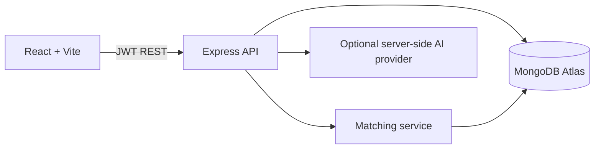

# CampusFind AI

AI-powered campus Lost & Found portal that connects lost and found reports using explainable similarity signals.

## Problem and solution

Campus reports are fragmented, and two people often describe the same item differently. CampusFind stores structured report attributes and compares opposite-type reports using description overlap, category, color, location, and date proximity. The result is a ranked *possible match*, never a claim of ownership.

## Features

- JWT authentication with bcrypt password hashing
- Lost and found reporting with image upload limits
- Search and filters for active reports
- Explainable weighted match scoring
- In-app match notifications
- Browser voice input for descriptions
- Responsive React dashboard and report workflow
- MongoDB indexes for common item queries

## Architecture

## Stack

React, Vite, React Router, Axios, CSS, Node.js, Express, Mongoose, MongoDB Atlas, JWT, bcryptjs, Multer, and optional Gemini/OpenAI integration.

## Local setup

1. Copy `.env.example` to `.env` and set `JWT_SECRET` and `MONGODB_URI`.
2. Install and run the API: `cd server`, `npm install`, `npm run dev`.
3. In another terminal run the client: `cd client`, `npm install`, `npm run dev`.
4. Open the Vite URL, normally `http://localhost:5173`.

Client environment: `VITE_API_URL=http://localhost:5000/api`.

## API overview

- `POST /api/auth/register`, `POST /api/auth/login`, `GET /api/auth/me`
- `GET /api/items`, `POST /api/items/lost`, `POST /api/items/found`
- `GET /api/items/mine`, `GET /api/items/:id/matches`
- `GET /api/matches`, `GET /api/matches/:id`
- `GET /api/notifications`, `PATCH /api/notifications/:id/read`
- `GET /api/health`

## AI matching

New reports search only active reports of the opposite type. Candidate reports are scored with configurable weights in `server/src/services/matchingService.js`. Current baseline uses explainable lexical and attribute similarity, and is intentionally honest about its limits. A production semantic provider can be added server-side through `AI_API_KEY` without exposing secrets to the browser.

## Demo data

With MongoDB running, use `cd server; node src/seed.js`. Demo credentials: `demo@campusfind.local` / `CampusFindDemo8!`.

## Deployment

Deployment manifests are included in `render.yaml` and `client/vercel.json`. In Render, create the service from `render.yaml` and set `MONGODB_URI` and `CLIENT_URL`. In Vercel, import the repository with root directory `client`, build command `npm run build`, output directory `dist`, and `VITE_API_URL` set to the Render API URL. Add the final Vercel URL back to Render as `CLIENT_URL`.

## Security

Secrets are environment-only, passwords are hashed, protected APIs use JWT, CORS is restricted, uploads are size/type limited, and production errors avoid stack traces. Add a managed object store for images before production scale.

## Testing

Run backend checks with `cd server; npm test`. Run the client build with `cd client; npm run build`.

## Future improvements

Semantic embeddings, vision analysis, object-storage uploads, email delivery, admin moderation tools, contact handoff, and richer analytics are natural next increments.

## Author

Built as a placement-ready AIML engineering portfolio project.
